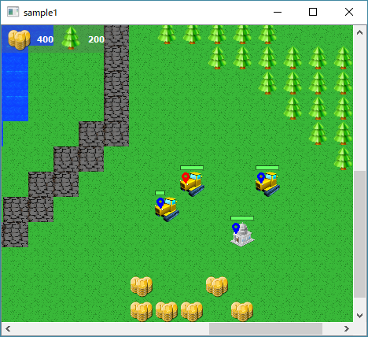

# Strategix — RTS game engine (draft)
The main aim of this project — to provide a template for common Real-Time Strategy games. 

## Contents
* core — strategix core library
* server — server based on this library
* map_editor — qt application for map editing
* sample1 — sample of client, based on map_editor



## Features
* Configuring games with json.
* Simple client-server protocol.
* Entities now able to collect resources and attack enemy units.

## Dependencies
* boost (filesystem, json, network, serialization, ...)
* qt >=5.10 (widgets for map editor)
* [easylogging++](https://github.com/muflihun/easyloggingpp) (logs)
* [nya](https://github.com/Akela1101/nya) (my toolbox)

## Build
Checked on the following compilers:

* **mingw64 gcc** from [msys2](http://www.msys2.org/).
* **msvc 15** (VS 2017)


```sh
cd <your projects dir>
git clone git@github.com:Akela1101/strategix.git
cd strategix
mkdir build && cd build
cmake .. # see below
make
```

CMake might ask for some options like a prefix to custom QT:

```sh
cmake -DCMAKE_PREFIX_PATH=C:\msys\mingw64\qt5-static ..
```
